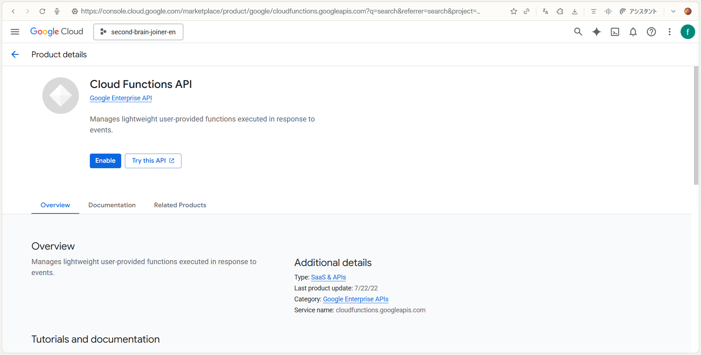
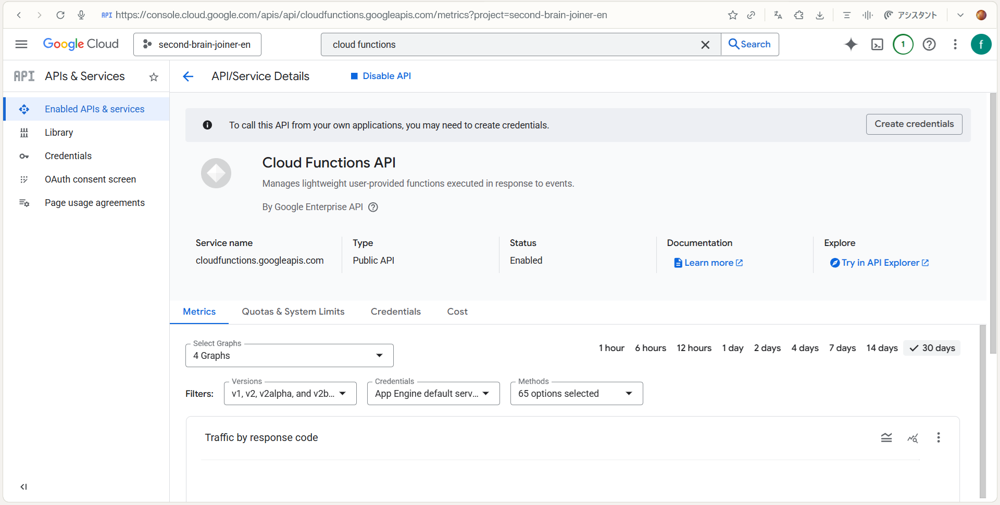
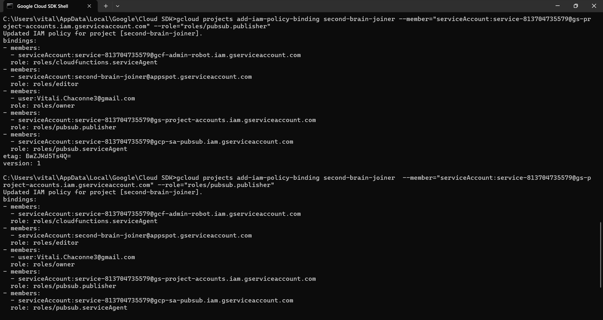
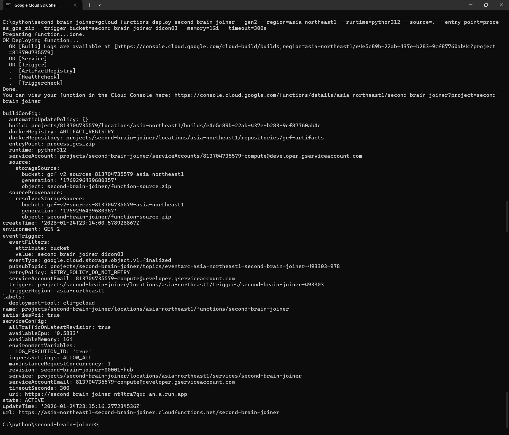
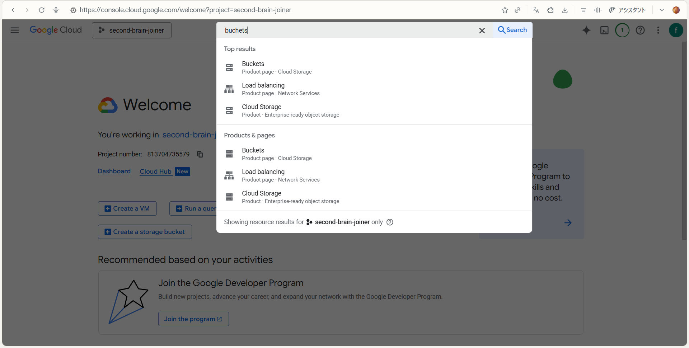
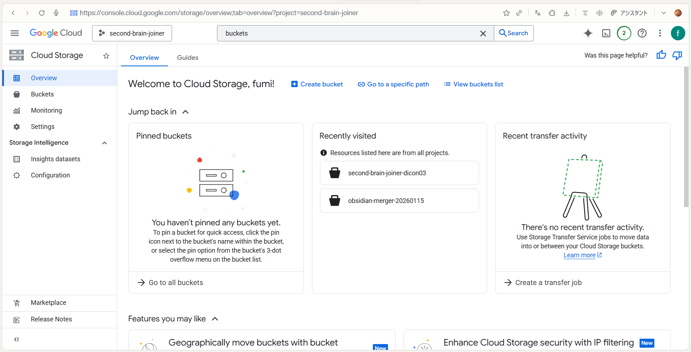
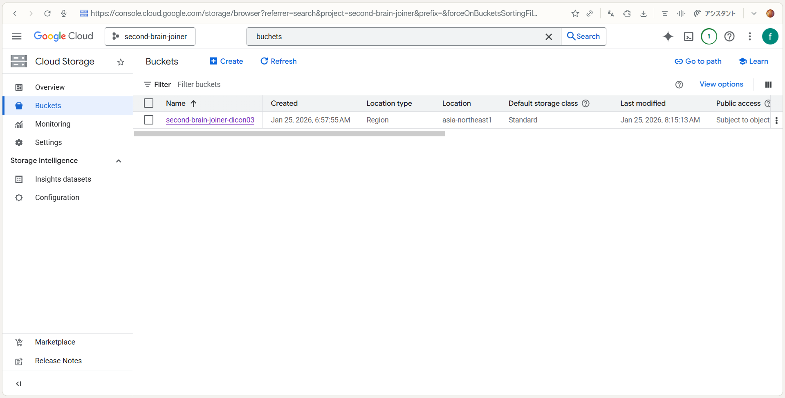
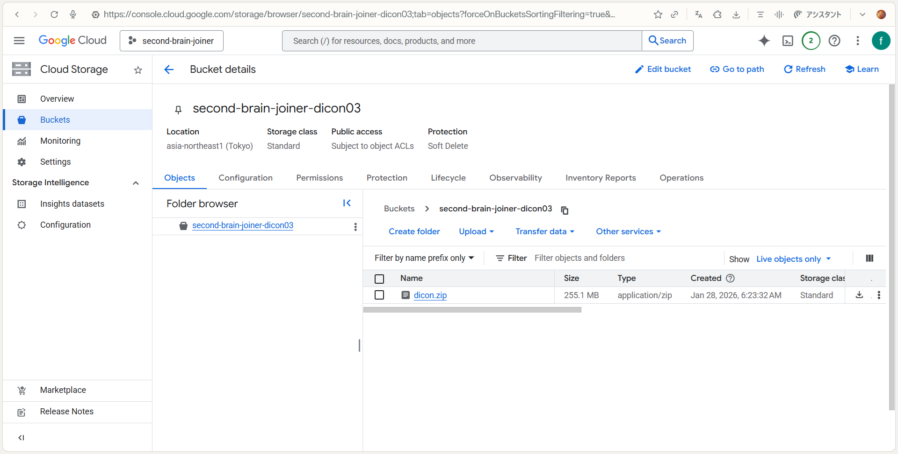
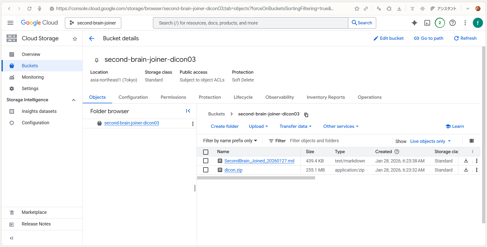

# Second Brain Joiner: Complete Implementation Guide 🧠✨
〜 Connecting your Obsidian (Second Brain) to AI 〜

This guide is designed for users who say, **"I'm not a programmer, but I'm comfortable using a PC."** We’ve avoided technical jargon as much as possible and included step-by-step instructions for every single click.

---

### 🗺️ Visual Overview: How it Works


> **The Concept:** As shown above, this tool creates a secure "bridge" in your private Google Cloud. You simply upload your vault (ZIP), and the Cloud Agent merges everything into a single, AI-ready file for you. [cite: 2026-01-27]

---

## 🛠 Step 0: Preparation
First, let's gather the "tools" needed to connect your computer to the cloud (Google's servers).

### 1. Google Account
Your regular Gmail account will work perfectly.

### 2. Prepare the Program Folder **(Important!)**
To ensure the commands work correctly, the folder structure must be precise. [cite: 2025-12-14]
1. Download the source code (Zip file) from the repository. [cite: 2026-01-27]
2. **Unzip the file directly into your C: Drive.**
3. This will automatically create the following path:
   `C:\python\second-brain-joiner`
4. Verify that files like `main.py`, `requirements.txt`, and `ReadMe.md` are inside that folder.

### 3. Install Google Cloud CLI
We will install the "Magic Wand" that allows you to control the cloud via text commands instead of just clicking.

1. Open the [Google Cloud CLI Install Page](https://cloud.google.com/sdk/docs/install).
2. Look for the **"Windows"** tab.
3. Click the blue link **"Download the Google Cloud CLI installer"** and save the file.
4. Run the installer. Generally, you can click "Next" or "I Agree" for all prompts until finished.

## ☁️ Step 1: Create a Google Cloud Project

First, create a private "Workspace (Project)" inside Google Cloud.

1. Log in to the **[Google Cloud Console](https://console.cloud.google.com/)**.
2. Click **"Select a project"** at the top of the screen (to the right of the "Google Cloud" logo).
3. Click **"New Project"** in the top right of the popup window.
4. Enter `second-brain-joiner` as the Project Name and click **"Create"**.
5. **【CRITICAL】Register Billing Settings**
   - Go to the "≡ (Hamburger Menu)" in the top left and select **"Billing"**. Complete the registration with a credit card.
   - **Estimated Cost (Don't worry!)**:
     I (Dicon) run this personally, and it costs roughly **$0.05 (8 JPY) per month**. **It’s literally cheaper than a cup of coffee per year!** ☕✨ [cite: 2025-12-14]
   - **Why is this necessary?**:
     Identity verification to prevent resource abuse. Google will not charge you unless you exceed the massive free tier.

---

## 🔍 Step 2: Note your ID and Project Number
You will need the "identification codes" for your project later.

1. Return to the Google Cloud Dashboard (Home).
2. Look at the **"Project Info"** card in the center of the screen.
3. Copy these two values to a notepad:
   - **Project ID**: (e.g., `second-brain-joiner-12345`)
   - **Project Number**: (e.g., `123456789012`)

---

## 🚀 Step 3: Casting the Magic Spells (Commands)
This is the heart of the setup! Open the "Google Cloud SDK Shell" from your application list.💡 
> [!TIP]
> 💡 **Quick Tip for the "Black Screen" (SDK Shell):**
> You can paste commands into this screen using either **"Ctrl + V"** or simply by **Right-Clicking** your mouse after copying. Both methods work perfectly! 😊

1. Login
```gcloud auth login```
A browser window will open. Select your Google account and click "Allow."

2. Specify your Project
① Check your Project ID:
```gcloud projects list```
② Set the Project (Replace brackets with your ID):
```gcloud config set project [YOUR_PROJECT_ID]```

3. Enable Google Cloud Features (GUI Recommended)
To ensure everything flows smoothly, it is safer to enable these **4 switches** via the browser. Go to the Search Bar at the top of the Google Cloud Console and enable each: 

　　　　　　　　　　　Click the "Enable" button on this screen

　　　　If "Disable API" is displayed in blue, it means the process was successful!

   1. **Cloud Functions API** (The main brain)
   2. **Cloud Build API** (The builder)
   3. **Cloud Run API** (The engine)
   4. **Eventarc API** (The observer)
   
   > 💡 **Tip:** Click the blue "Enable" button for each. If it says "API Enabled," you're good to go!

4. Create a Bucket (Your Private Storage)
You will create your own one-of-a-kind storage shed.
[Very important] The bucket name is first come, first served.
Add your favorite characters or numbers to the end of "second-brain-joiner-" to create your own unique name and record it in a notepad or similar. You will need it later!
> ⚠️ IMPORTANT: Bucket names are "First come, first served." Add unique letters/numbers to the end (e.g., `second-brain-joiner-dicon777`).
```gcloud storage buckets create gs://[YOUR_UNIQUE_NAME] --location=asia-northeast1```

5. "Compulsory summons" and issuance of "permits" to agents (persons in charge)
This is the final step. Immediately after turning on the API, the "Service Account Agent (person in charge)" will be hidden, so you must forcefully call it and then hand over the permit. (Note: Please replace the ID and number with your own and remove the [ ].)
① Call an agent:
```gcloud storage service-agent --project=[YOUR_PROJECT_ID]```
② Issue the first permit:
```gcloud projects add-iam-policy-binding  [YOUR_PROJECT_ID] --member="serviceAccount:service-[YOUR_PROJECT_NUMBER]@gcp-sa-eventarc.iam.gserviceaccount.com" --role="roles/storage.admin"```
③ Issue a second permit:
```gcloud projects add-iam-policy-binding [YOUR_PROJECT_ID] --member="serviceAccount:service-[YOUR_PROJECT_NUMBER]@gs-project-accounts.iam.gserviceaccount.com" --role="roles/pubsub.publisher"```


---

## 🛠️ How to tell if a command was successful
After casting the spell (command) on the black screen (SDK Shell), check the following points:

✅ Signs of success (big win!)

If you see a message like this, then the process is working properly!

- A line that says "Updated IAM policy for project [project name]" is displayed.
- Below that, lists such as bindings: and -members: are displayed.
- Finally, it returns to waiting for the next input: C:\Users\...>.

> 💡 Beginners often
make the mistake of thinking, "There's a lot of English! It's an error!" But if it says "Updated," then you've succeeded. Don't worry, you can move on to the next step!

❌ Signs of Failure (Needs a re-check!)
- Contains the word ERROR:
- Words such as INVALID_ARGUMENT and Permission Denied , which mean "denial", appear.
- The words "Updated..." do not appear and the message stops after a few lines.

> 🆘 What to do? 
 Don't panic. First, double-check that you've linked your payment settings and pressed the "Enable API in your browser" button .

📊 Quick Diagnostic Table
| Status | Keywords to look for | Screen Vibe |
| :--- | :--- | :--- |
| **✅ SUCCESS!** | **Updated**, **bindings** | Busy screen, but ends peacefully. |
| **❌ FAILURE...** | **ERROR**, **Denied**, **Not found** | Short, stops with "angry" red-looking text. |

---

## 🏗️ Step 4: Deploying the Program
Now, let's put the program into the cloud!
1. Move to your folder:
On the black screen (SDK Shell), go to the folder where the file is saved. Copy and paste the following command and press Enter.
```cd /d C:\python\second-brain-joiner```
2. Execute the deploy command
Copy the following command, rewrite it using Notepad or similar, and then paste it.
⚠️Note : Replace the part after --trigger-bucket= with the "your own bucket name" you created in Step 3-4 . If you make a mistake here, an error will occur!
```gcloud functions deploy second-brain-joiner --gen2 --region=asia-northeast1 --runtime=python312 --source=. --entry-point=process_gcs_zip --trigger-bucket=[YOUR_BUCKET_NAME] --memory=1Gi --timeout=300s```

## ☕ Wait 3 to 5 Minutes
The screen might look stuck, but Google is working hard to **Build your App Environment**. Take a coffee break!

- ✅ Success Sign: When you see state: ACTIVE and a Service URL, it’s live!

If you see a screen like this, the process was successful!
💡 If it asks "(y/N)?", type y and hit Enter.
If you see an error message in red, double-check the "Personal Bucket Name" you created in Step 3-4!

---

## 📖 Step 5: How to Use Second Brain Joiner 
It's time to connect your "second brain"!
1. Zip your notes: Compress your Obsidian vault into a ZIP file.
2. Find your "Bucket": 

Click on “Bucket (Cloud Storage)” in the search results.


From the list, find and click on the "your bucket name (e.g. second-brain-joiner-dicon03)" that you created in Step 3!

3. Upload & Merge: 
① Drag and drop the ZIP file you prepared onto the screen. (Or click the "Upload File" button.)
② Once the upload is complete, your ZIP file will appear at the bottom of the screen.

③ Wait 5 to 10 seconds.

4. Download the Result: 
- Click "Refresh" (or reload your browser).
- Like magic, a file named SecondBrain_Joined_YYYYMMDD.md will appear! 🎉

- Click and Download.

---

## ⚖️ Disclaimer
- Use at your own risk: The developer is not responsible for data loss or cloud usage fees.
- No Warranty: Provided "as-is."
- Backup: Always backup your vault before use.

---

**Sorted & Verified by Second Brain Joiner (AI Architect: Dicon / Hirofumi Inoue)** 

